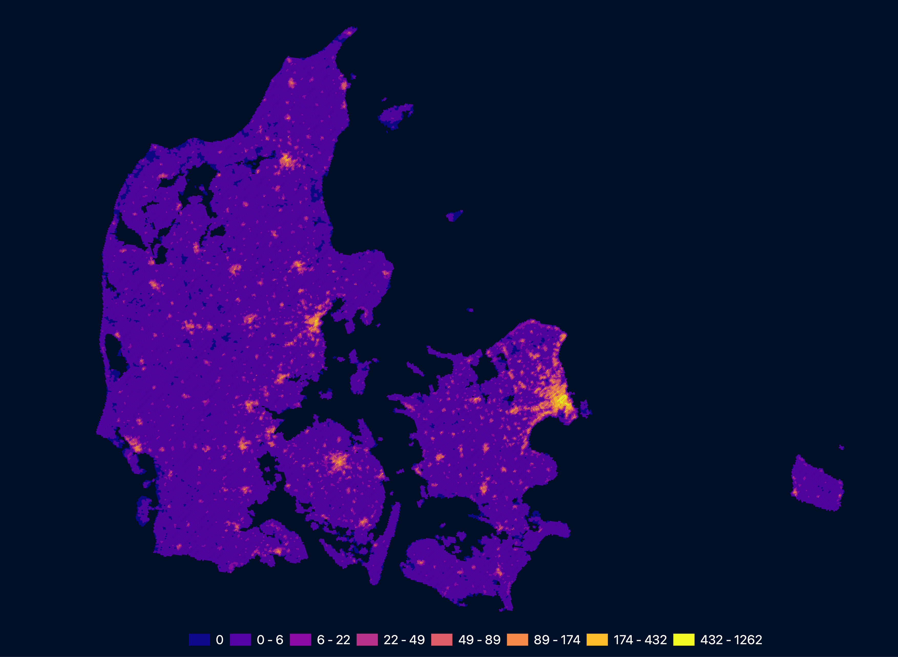
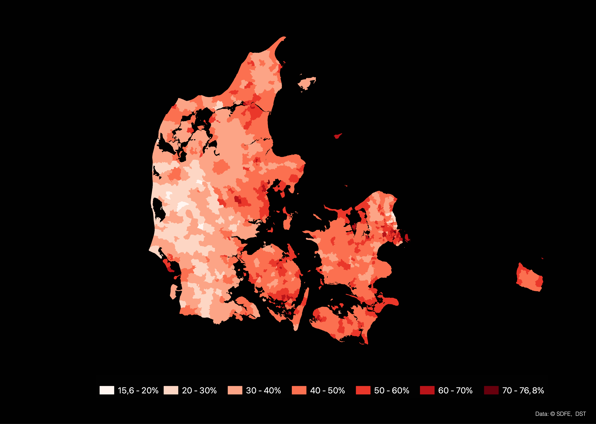
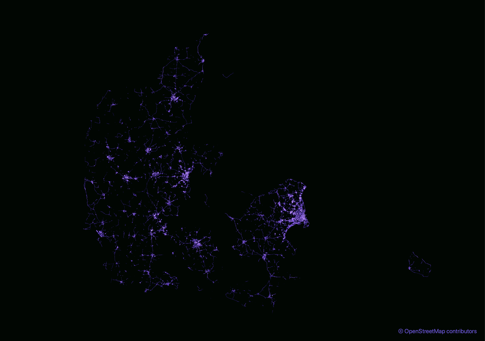

## Day 14: Hexagons

Population density in Denmark using H3 and EU's Global Human Settlement Layer. I like how the 1947 'Finger Plan' for greater CPH (<https://en.wikipedia.org/wiki/Finger_Plan>) is still perceptible 🖐️

 

## Day 11: Red

*On the occasion of DK's recent national election: Share of votes for the 'red' parties in each voting district.*

 

## Day 6: Network

*Network(s) of bicycle infrastructure in Denmark.*

